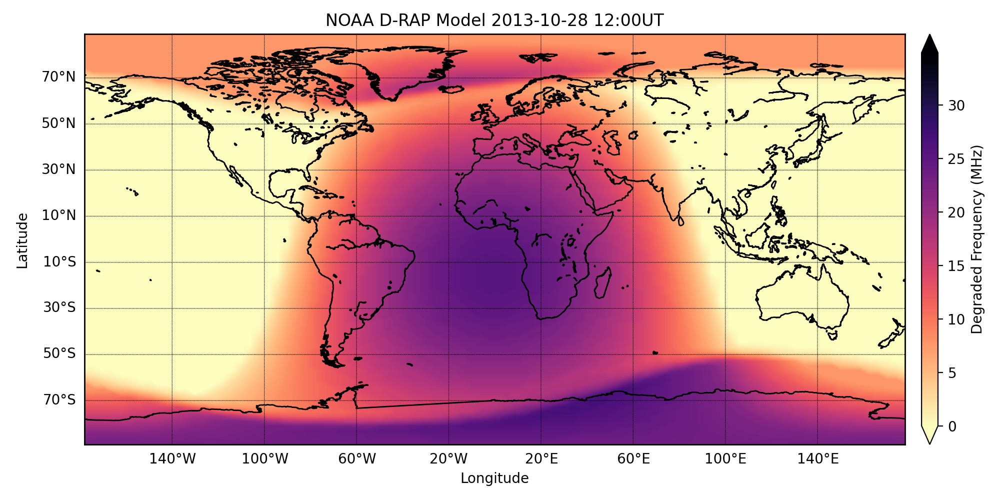

# Plot NOAA D-RAP 

 Python Code for Plotting the NOAA D-Region Absorption Prediction (D-RAP) Product 
 See more here on [NOAA site] (https://www.swpc.noaa.gov/products/d-region-absorption-predictions-d-rap)
 
 The code to download and plot the D-RAP model at a certain time is given in *download_and_plot_drap.py*
 
 To change the time of interest change
 ''' python
 
 search_time = '2013-10-28 12:00'
 
 ''''
 
 The output at moment will show the D-RAP model over Europe. The degraded frequency map is the highest frequency affected by absorption of 1dB cause by solar activity (flares) affecting the D-region of the ionosphere
 
 
 
 